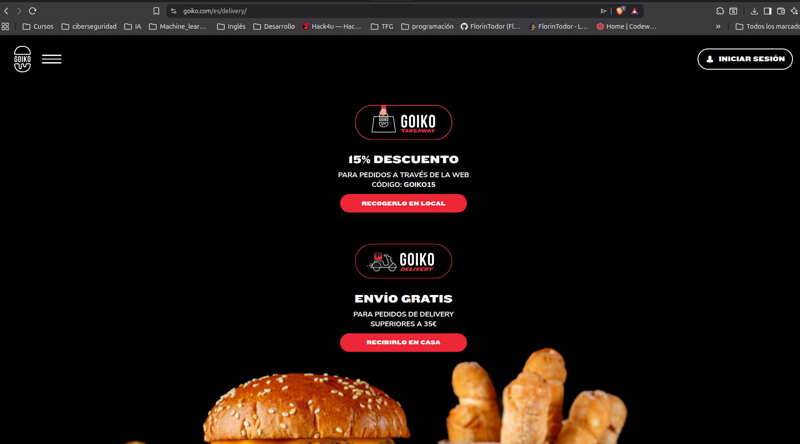
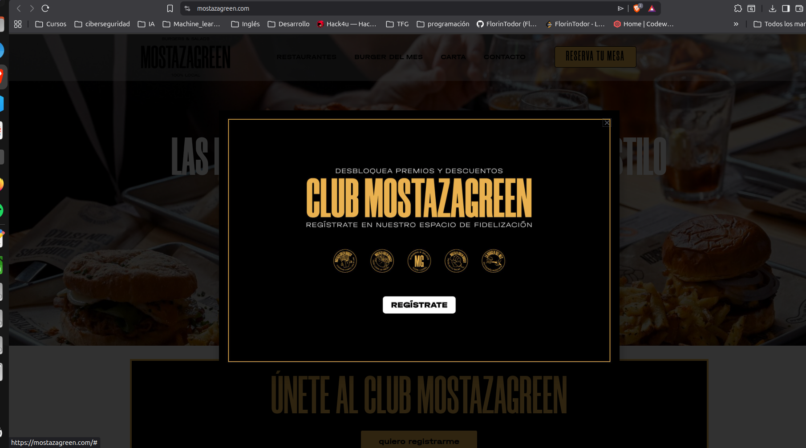
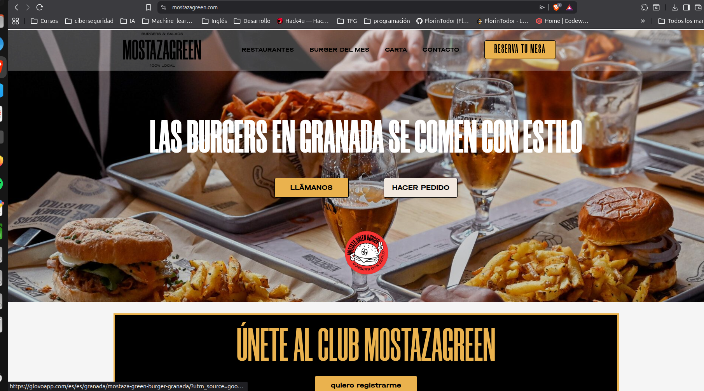
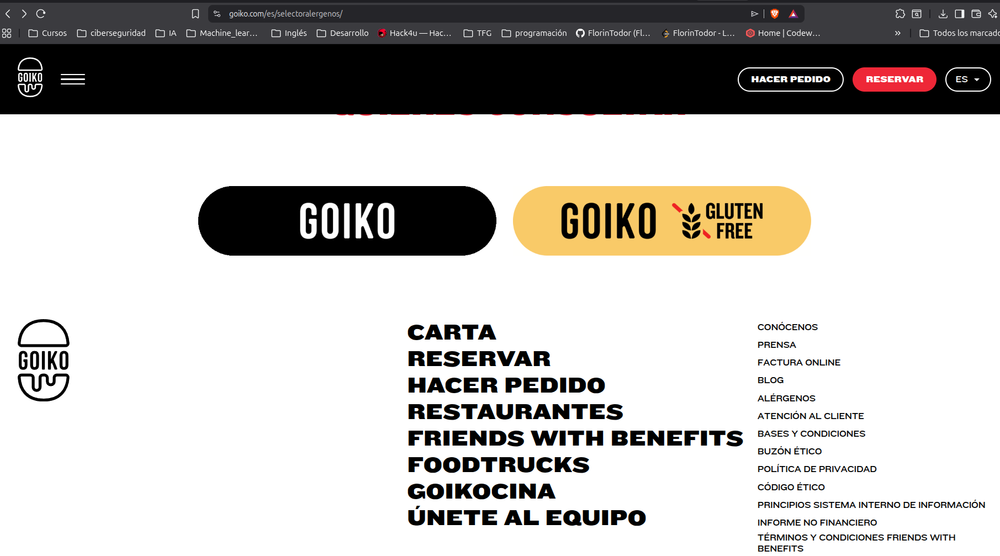
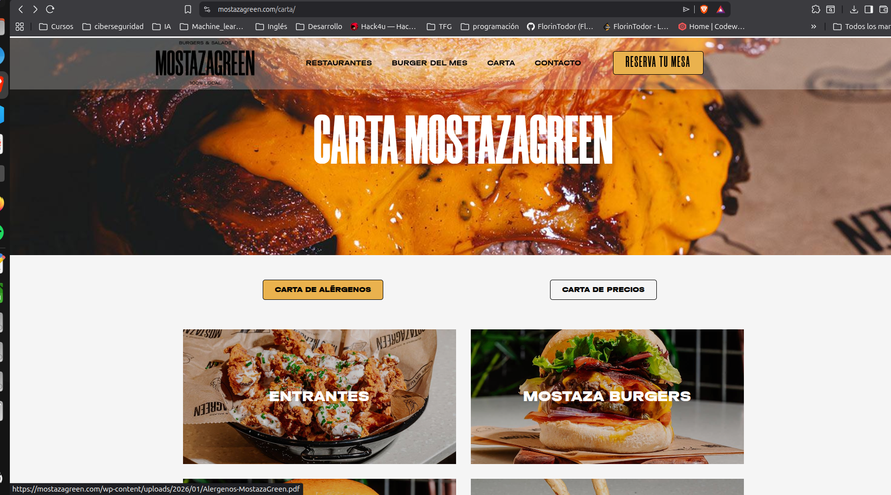
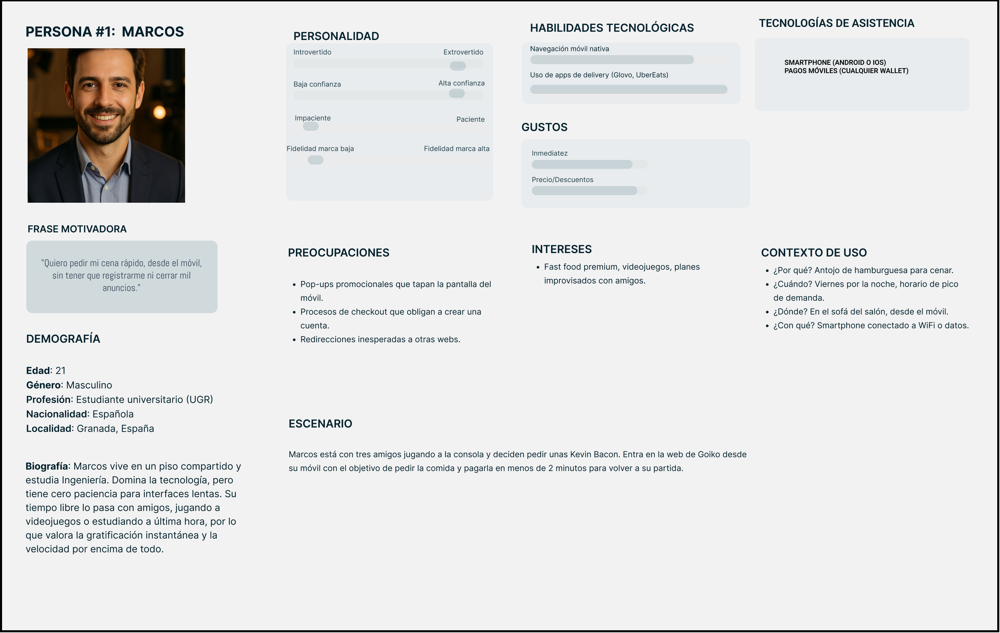
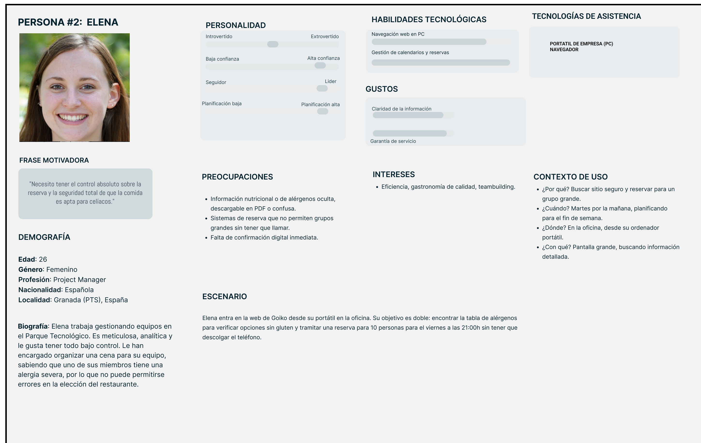
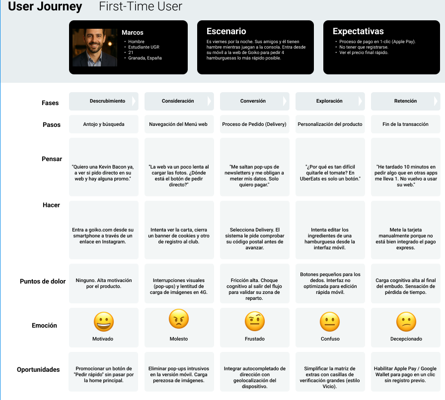
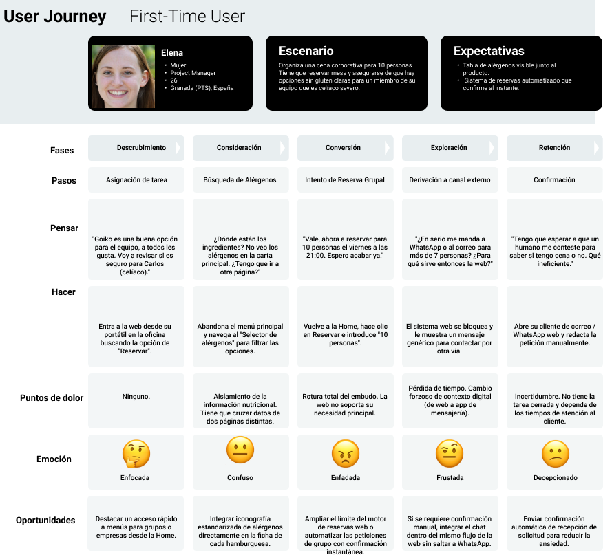

# DIU26
Prácticas Diseño Interfaces de Usuario (Tema: .... ) 

* [Guiones de prácticas](GuionesPracticas/)
* [Guía para crea tu Case Study](Guia_CaseStudy.md)
* Sala de la Fama [DIU Hall of fame](https://github.com/mgea/DIU/tree/master/hall_of_fame) donde se pueden encontrar Case Study destacados de otros años.
* [Recursos/plantillas en figma](https://www.figma.com/design/BN2IR0q2clOSplfMmalh9K/DIU_Toolkit_Framework--2026-)

Actualizado: 14/01/2026

## Paso 0 My UX-Case Study
 
-----

Grupo: DIU3_ADE.  Curso: 2025/26 Grado: Ingeniería Informática + ADE

Nombre del Proyecto: 

>>> Decida el nombre corto de su propuesta en la práctica 2  (rellenar más adelante)

Descripción: 

>>> Describa la idea de su producto en la práctica 2  (rellenar más adelante)

Logotipo: 

>>> Si diseña un logotipo para su producto en la práctica 3 pongalo aqui, a un tamaño adecuado. Si diseña un slogan añadalo aquí (rellenar más adelante)

Miembros y nombre del equipo:
Nombre del equipo: DI3.ADE
 * :bust_in_silhouette:  Florín Emanuel Todor Gliga     :octocat:     : https://github.com/FlorinTodor
 * :bust_in_silhouette:  Laura Zafra Alarcos     :octocat:            : https://github.com/LauraZafra

----- 

 

# Proceso de Diseño 

 

## Paso 1. UX User & Desk Research & Analisis 

### 1.a User Reseach Plan
 
-----

## 1. Project Background (Contexto y Justificación)
El mercado del *fast-food* premium en Granada combina un alto volumen de usuarios universitarios que exigen inmediatez digital con profesionales que buscan experiencias en local. La hipótesis central de esta investigación es que la web de Goiko prioriza el impacto visual (*food porn*) sobre la propoa usabilidad de la aplicación. Esta sobrecarga estética y la dependencia de plataformas externas para completar pedidos (*delivery*) generan fricción cognitiva y abandono en el embudo de conversión, afectando directamente a las ventas online.

## 2. Research Goals & KPIs (Objetivos y Métricas)

| Objetivos de Investigación | KPIs (Indicadores Clave de Rendimiento) |
| :--- | :--- |
| **Evaluar la fricción en el embudo de conversión del pedido a domicilio (Delivery).** | - Tasa de abandono en la pantalla de selección de extras. - Número de clics necesarios para llegar al *checkout*. |
| **Analizar la usabilidad del sistema de reservas de mesas.** | - Tiempo promedio para completar una reserva de mesa para un grupo. - Tasa de éxito en el primer intento sin errores del sistema. |
| **Medir la accesibilidad de la información nutricional crítica.** | - Tiempo requerido para localizar la tabla de alérgenos. - Número de pasos para identificar opciones sin gluten. |

## 3. Research Methods (Metodología)
* **Cualitativa (Contextual Inquiry):** Observación directa de usuarios intentando realizar un pedido real desde su *smartphone* en un entorno ruidoso o con distracciones, para identificar la fatiga visual y los bloqueos ante ventanas modales (promociones).
* **Cuantitativa (Usability Test / Heuristic Review):** Aplicación de una lista de verificación de usabilidad (basada en heurísticas de Nielsen) para puntuar la severidad de los errores de interfaz en la navegación móvil y de escritorio.

## 4. Research Questions (Preguntas de Investigación)
1. ¿Qué elementos visuales o modales interrumpen al usuario antes de poder ver el precio final de su pedido?
2. ¿Con qué facilidad puede un usuario con restricciones alimentarias asegurar que su pedido es seguro para su consumo?
3. ¿La derivación de tráfico hacia plataformas de terceros (como Glovo o UberEats) rompe la confianza o el flujo de la experiencia del usuario?

## 5. Experience in this field (Perspectivas)
* **My personal experience:** El diseño orientado al *marketing* agresivo a menudo destruye la operabilidad. La retención de usuarios en restauración depende más de pedir en 3 clics que de ver imágenes en ultra alta resolución que ralentizan la carga en dispositivos móviles.
* **As a designer:** Observo que la arquitectura de la información es inconsistente; elementos críticos como los alérgenos están enterrados en menús secundarios en lugar de integrados en la ficha contextual del producto.
* **As an observer:** Los usuarios frecuentemente se frustran al intentar cerrar *banners* de suscripción a *newsletters* que tapan los botones de llamada a la acción (CTA) principales en pantallas pequeñas.
* **People say (User voice):** *"Solo quería pedir una Kevin Bacon rápida, pero la web me obligó a saltar a otra aplicación y perdí el hilo de lo que estaba haciendo"*.

## 6. Participant Recruitment (Reclutamiento)
* **Perfil 1: El Impaciente Digital.** Estudiantes universitarios (18-26 años) que buscan realizar un pedido a domicilio desde el móvil con la máxima velocidad y el mínimo esfuerzo cognitivo.
* **Perfil 2: El Planificador Restringido.** Profesionales (30-45 años) encargados de reservar para un grupo presencial, incluyendo la necesidad de verificar información de alérgenos de forma estricta.

### 1.b Competitive Analysis
 
-----
Para este análisis competitivo, contrastamos el modelo corporativo de Goiko con dos competidores locales consolidados en Granada: **Mumama Burger** y **Mostaza Green**. Esta comparativa expone cómo la usabilidad se resiente tanto por la sobresaturación de elementos en grandes cadenas como por la falta de madurez digital en negocios locales.

**Tabla Resumen de Competencia:**

### 3. [DESK RESEARCH: COMPETITOR ANALYSIS]

Para este análisis competitivo, contrastamos el modelo corporativo de Goiko con dos competidores locales consolidados en Granada: **Mumama Burger** y **Mostaza Green**. 

**Tabla Resumen de Competencia:**

| Funcionalidad / UX | [Goiko (Caso de Estudio)](https://www.goiko.com/es/) | [Mumama Burger](https://www.mumama.es/) | [Mostaza Green Burger](https://mostazagreen.com/) |
| :--- | :--- | :--- | :--- |
| **Arquitectura de la Información** | Sobrecargada. Alta densidad de *pop-ups* y opciones.     | Básica e informativa. Actúa como un escaparate digital estático. | Narrativa visual, pero con interrupciones críticas (pop-ups de fidelización).     |
| **Flujo de Conversión (Delivery)** | Híbrido con fricción. Retiene al usuario en su sistema propio pero genera pasos extra. | Deficiente. Delegación total de la conversión. | Externalizado. Deriva directamente a Glovo.     |
| **Accesibilidad (Alérgenos)** | Aislada. Obliga al usuario a abandonar el menú principal para consultar otra sección.     | Nula a nivel digital. El usuario debe llamar al local o consultar in situ. | Carga cognitiva alta. Te obliga a descargar o abrir un PDF externo.     |
| **Sistema de Reservas** | Fricción en grupos. El flujo digital se rompe a partir de 7 personas, derivando a WhatsApp.    [🎥 Ver evidencia en vídeo](https://drive.google.com/file/d/1zAYtOdyyOtWYvLSiPs0dvJJ-7O3Mhk-i/view?usp=sharing) | Limitado. Ante aforos completos, exige llamar por teléfono. | Informativo. No disponen de un motor de reservas digital claro. |

 

**Valoración y Justificación de la Competencia:**

El análisis competitivo, respaldado por evidencias visuales de las plataformas, revela que tanto el exceso como la carencia de desarrollo digital destruyen el embudo de conversión. Goiko, nuestro caso de estudio, presenta una interfaz hiper-saturada donde la accesibilidad nutricional está aislada y las reservas grupales obligan a salir de la web hacia WhatsApp. 

Sin embargo, competidores locales como **Mostaza Green** demuestran que la alternativa no es necesariamente mejor, interrumpiendo la navegación con *pop-ups* invasivos, gestionando los alérgenos mediante PDFs poco accesibles desde móvil y externalizando el *delivery* a plataformas de terceros. En conclusión, mientras los actores locales fallan por omisión y falta de madurez digital, Goiko falla por sobrecarga cognitiva, ofreciendo una oportunidad clara para proponer un rediseño que equilibre estética y conversión sin fricciones.

### 1.c Personas

 
**Marcos (El Impaciente Digital):** Representa la urgencia del sector universitario. Busca pedir comida rápido desde el móvil sin fricción ni distracciones.

 
**Elena (La Planificadora Rigurosa):** Perfil analítico corporativo. Evalúa la reserva online y la claridad de la información nutricional ante intolerancias.

-----
-----
-----

### 1.d User Journey Map

 
**Justificación Journey Marcos (Delivery Rápido):** Hemos planteado el caso de Marcos porque refleja lo que nos pasa a todos un viernes por la noche: queremos la comida ya y tenemos cero paciencia. Lo más habitual cuando intentas pedir desde el móvil en estas webs es que te frían a *pop-ups* o te obliguen a crearte una cuenta. Al final, la fricción es tan alta que el usuario se cansa, cierra la pestaña y se va a pedir lo mismo por Glovo simplemente porque ahí ya tiene la tarjeta guardada y paga en un clic.

 
**Justificación Journey Elena (Reservas y Alérgenos):** El caso de Elena representa el típico dolor de cabeza al organizar una cena de empresa o de amigos. Es frustrante, y muy común, intentar reservar para un grupo grande y que la web colapse o te obligue a llamar por teléfono, rompiendo toda la utilidad de hacerlo online. Además, cuando tienes a alguien celíaco en el grupo, esconder los alérgenos en otra página en lugar de ponerlos claros al lado del plato genera mucha desconfianza. Es un fallo crítico que te hace descartar el restaurante.

### 1.e Usability Review
 
----

>>>  El objetivo es revisar la usabilidad del competidor seleccionado. Usamos un checklist de verificación. Tras usarlo, subelo a la carpeta P1/ Ofrece aquí un parrafo para:
>>> - Enlace al documento:  (xls/pdf) 
>>> - URL y Valoración numérica obtenida: 
>>> - Comentario sobre la revisión:  (puntos fuertes y débiles detectados)

 

## Paso 2. UX Design  

>>> Cualquier título puede ser adaptado. Recuerda borrar estos comentarios del template en tu documento

### 2.a Reframing / IDEACION: Feedback Capture Grid / EMpathy map 
 
----

>>> Comenta con un diagrama los aspectos más destacados a modo de conclusion de la práctica anterior. De qué carece la competencia?? Tu diagrama puede ser una figura subida a la carpeta P2/

 Interesante | Críticas     
| ------------- | -------
  Preguntas | Nuevas ideas
  
    
>>> Explica el Problema y plantea una hipótesis. Es decir, explica aquí qué 
>>> se plantea como "propuesta de valor" para un nuevo diseño de aplicación propio

### 2.b ScopeCanvas

----

>>> Propuesta de valor, pero ahora en vez de un texto es un ScopeCanvas que has subido a P2/ y enlazado desde aqui. Tambien vale una imagen miniatura del recurso.
>>> No olvides que tu propuesta ya tiene un nombre corto y puedes actualizar la cabecera de este archivo

### 2.b User Flow (task) analysis 
 
-----

>>> Definir "User Map" y "Task Flow" ... enlazar desde P2/ y describir brevemente

### 2.c IA: Sitemap + Labelling 
 
----

>>> Identificar términos para diálogo con usuario (evita el spanglish) y la arquitectura de la información. Es muy apropiado un diagrama tipo sitemap y una tabla que se ampliaría para llevar asociado la columna iconos (tanto para la web como para una app). 

Término | Significado     
| ------------- | -------
  Login  | acceder a plataforma

### 2.d Wireframes
 
-----

>>> Plantear el diseño del layout para Web/movil (organización y simulación). Describa la herramienta usada 

 

## Paso 3. Mi UX-Case Study (diseño)

>>> Cualquier título puede ser adaptado. Recuerda borrar estos comentarios del template en tu documento

### 3.a Moodboard

-----

>>> Diseño visual con una guía de estilos visual (moodboard) 
>>> Incluir Logotipo. Todos los recursos estarán subidos a la carpeta P3/
>>> Explique aqui la/s herramienta/s utilizada/s y el por qué de la resolución empleada. Reflexione ¿Se puede usar esta imagen como cabecera de Instagram, por ejemplo, o se necesitan otras?

### 3.b Landing Page
 
----

>>> Plantear el Landing Page del producto. Aplica estilos definidos en el moodboard

### 3.c Guidelines
 
----

>>> Estudio de Guidelines y explicación de los Patrones IU a usar 
>>> Es decir, tras documentarse, muestre las deciones tomadas sobre Patrones IU a usar para la fase siguiente de prototipado. 

### 3.d Mockup
 
----

>>> Consiste en tener un Layout en acción. Un Mockup es un prototipo HTML que permite simular tareas con estilo de IU seleccionado. Muy útil para compartir con stakeholders

 

## Paso 4. Pruebas de Evaluación 

### 4.a Reclutamiento de usuarios 

-----

>>> Breve descripción del caso asignado (llamado Caso-B) con enlace al repositorio Github
>>> Tabla y asignación de personas ficticias (o reales) a las pruebas. Exprese las ideas de posibles situaciones conflictivas de esa persona en las propuestas evaluadas. Mínimo 4 usuarios: asigne 2 al Caso A y 2 al caso B.

| Usuarios | Sexo/Edad     | Ocupación   |  Exp.TIC    | Personalidad | Plataforma | Caso
| ------------- | -------- | ----------- | ----------- | -----------  | ---------- | ----
| User1's name  | H / 18   | Estudiante  | Media       | Introvertido | Web.       | A 
| User2's name  | H / 18   | Estudiante  | Media       | Timido       | Web        | A 
| User3's name  | M / 35   | Abogado     | Baja        | Emocional    | móvil      | B 
| User4's name  | H / 18   | Estudiante  | Media       | Racional     | Web        | B 

### 4.b Diseño de las pruebas 
 
-----

>>> Planifique qué pruebas se van a desarrollar. ¿En qué consisten? ¿Se hará uso del checklist de la P1?

### 4.c Cuestionario SUS
 
----

>>> Como uno de los test para la prueba A/B testing, usaremos el **Cuestionario SUS** que permite valorar la satisfacción de cada usuario con el diseño utilizado (casos A o B). Para calcular la valoración numérica y la etiqueta linguistica resultante usamos la [hoja de cálculo](https://github.com/mgea/DIU19/blob/master/Cuestionario%20SUS%20DIU.xlsx). Previamente conozca en qué consiste la escala SUS y cómo se interpretan sus resultados
http://usabilitygeek.com/how-to-use-the-system-usability-scale-sus-to-evaluate-the-usability-of-your-website/)
Para más información, consultar aquí sobre la [metodología SUS](https://cui.unige.ch/isi/icle-wiki/_media/ipm:test-suschapt.pdf)
>>> Adjuntar en la carpeta P4/ el excel resultante y describa aquí la valoración personal de los resultados 

### 4.d A/B Testing
 
-----

>>> Los resultados de un A/B testing con 3 pruebas y 2 casos o alternativas daría como resultado una tabla de 3 filas y 2 columnas, además de un resultado agregado global. Especifique con claridad el resultado: qué caso es más usable, A o B?

### 4.e Aplicación del método Eye Tracking 

----

>>> Indica cómo se diseña el experimento y se reclutan los usuarios. Explica la herramienta / uso de gazerecorder.com u otra similar. Aplíquese únicamente al caso B.

  
>>> Cambiar esta img por una de vuestro experimento. El recurso deberá estar subido a la carpeta P4/  

>>> gazerecorder en versión de pruebas puede estar limitada a 3 usuarios para generar mapa de calor (crédito > 0 para que funcione) 

### 4.f Usability Report de B
 
-----

>>> Añadir report de usabilidad para práctica B (la de los compañeros) aportando resultados y valoración de cada debilidad de usabilidad. 
>>> Enlazar aqui con el archivo subido a P4/ que indica qué equipo evalua a qué otro equipo.

>>> Complementad el Case Study en su Paso 4 con una Valoración personal del equipo sobre esta tarea

 

## Paso 5. Exportación y Documentación 

### 5.a Exportación a HTML/React
 
----

>>> Breve descripción de esta tarea. Las evidencias de este paso quedan subidas a P5/

### 5.b Documentación con Storybook

----

>>> Breve descripción de esta tarea. Las evidencias de este paso quedan subidas a P5/

 

## Conclusiones finales & Valoración de las prácticas

>>> Opinión FINAL del proceso de desarrollo de diseño siguiendo metodología UX y valoración (positiva /negativa) de los resultados obtenidos. ¿Qué se puede mejorar? Recuerda que este tipo de texto se debe eliminar del template que se os proporciona 

